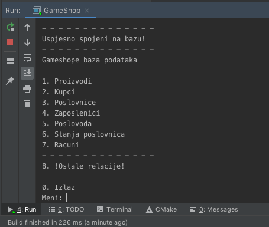
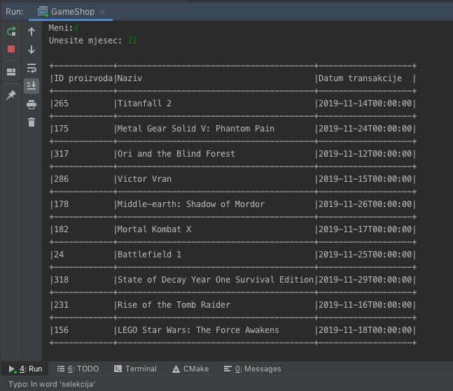
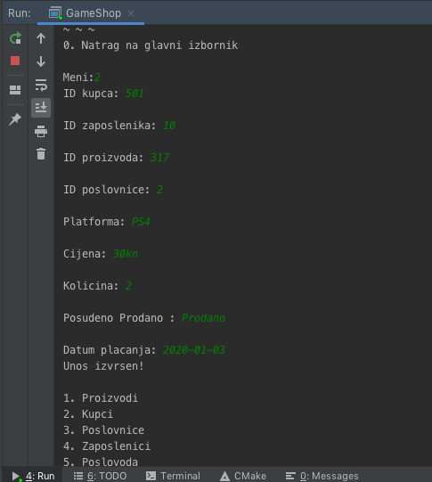

# GSMS

Application name:
**Game Store management system**

Faculty of informatics pula:
https://fipu.unipu.hr/

\

\
Kolegij:
**[Baze podataka II](https://fipu.unipu.hr/fipu/predmet/bazpod2_a)**

Note:
Projekt se sastojio od C++ programa koji je bio spojen na bazu podataka te omogucio pregled, unos, brisanje i izmjenu podataka u bazi. Program je bio namijenjen za upravljanje prodajom igara u maloprodaji.

Ak.god. **2019/20**  
Nastavnik: doc. dr. sc. **[Goran Oreški](https://fipu.unipu.hr/fipu/goran.oreski)**  
Izvođač: **Zlatko Sirotić**, univ. spec. inf.

## User interface

|             Main menu              |                     Sold in a month - Procedure                      |                    Invoice entry - Procedure                     |
| :--------------------------------: | :------------------------------------------------------------------: | :--------------------------------------------------------------: |
|  |  |  |

## ER dijagram

## Video prezentacija

